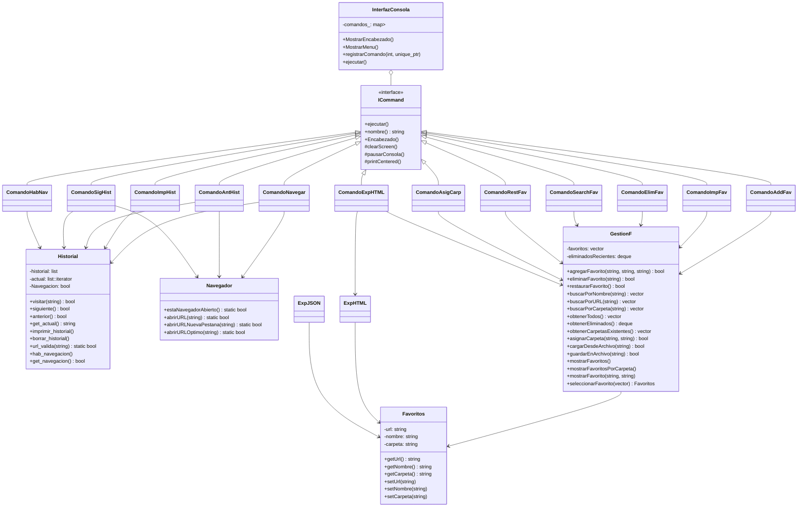

# 🚀 Proyecto Soonata: Navegador Web en Consola

## 👥 Desarrolladores

| Nombre          | Cédula de Identidad |
|-----------------|---------------------|
| **Luis Rojas**  |     30931891        |
| **Daniel Reyna**|     29989066        |
| **Nicole Sereno**|    31275411        |
| **Paola Peña**  |     31152816        |

---

## 📝 Descripción del programa

Soonata es un navegador web en consola que implementa funcionalidades avanzadas como gestión de historial, favoritos organizados en carpetas, 
exportación a HTML/JSON, y reproducción de música de fondo. Su arquitectura modular basada en el patrón Command permite una fácil expansión y 
mantenimiento del código.

---

## 📊 Diagrama UML de Clases

### 🖥️ InterfazConsola
**Responsabilidad:**  
Maneja toda la interacción del usuario con el sistema a través de la línea de comandos. Implementa el patrón Command para ejecutar acciones.

**Características clave:**
- Registra y gestiona comandos disponibles
- Muestra menús interactivos
- Controla el flujo principal de la aplicación
- Proporciona funciones de formato para la consola

---

### 📜 Historial
**Responsabilidad:**  
Gestiona el registro de navegación del usuario.

**Funcionalidades:**
- ✅ Almacenar URLs visitadas
- ↔️ Navegar hacia adelante/atrás en el historial
- 🔍 Validar formatos de URLs mediante expresiones regulares
- 🚦 Controlar el estado de navegación (habilitado/deshabilitado)

**Método destacado:** `url_valida()`  
Implementa un sistema de validación robusto con regex para verificar URLs.

---

### 📌 GestionF
**Responsabilidad:**  
Administra el sistema completo de favoritos.

**Funcionalidades CRUD:**
- ➕ Agregar nuevos favoritos
- ❌ Eliminar favoritos con historial de eliminados
- ♻️ Restaurar favoritos eliminados recientemente
- 🔍 Buscar por múltiples criterios (nombre, URL, carpeta)
- 🗂️ Organizar en carpetas temáticas
- 💾 Importar/exportar datos (CSV, JSON)

**Característica única:**  
Mantiene un historial de los últimos 5 favoritos eliminados para posible restauración.

---

### 🌐 Navegador
**Responsabilidad:**  
Proporciona integración con el sistema operativo.

**Funcionalidades:**
- 🔍 Detectar navegadores abiertos (multiplataforma)
- 🪟 Abrir URLs en nuevas ventanas
- 📑 Abrir URLs en nuevas pestañas
- 🚀 Optimizar apertura según contexto (nueva ventana vs. pestaña)

**Soporte multiplataforma:**  
Implementa lógica específica para Windows, macOS y Linux.

---

### 🎵 MusicPlayer
**Responsabilidad:**  
Implementa un reproductor de música de fondo.

**Características técnicas:**
- 🎲 Carga aleatoria de archivos (OGG, WAV, FLAC)
- 🔊 Control de volumen (0-100%)
- 🧵 Ejecución en hilo separado (sin bloquear interfaz)
- 🔄 Reproducción continua automática
- 📂 Escaneo automático de carpeta `media/`

**Patrón de diseño:**  
Implementa Singleton para garantizar una única instancia.

---

### 📂 Favoritos
**Responsabilidad:**  
Modela un sitio web guardado como favorito.

**Estructura de datos:**
- 🌐 URL del sitio web
- 🔤 Nombre descriptivo
- 🗂️ Carpeta de organización

**Métodos disponibles:**
- Getters y setters para todos los campos
- Serialización/deserialización para almacenamiento

---

### 📄 ExpHTML/ExpJSON
**Responsabilidad:**  
Sistemas de exportación/importación de datos.

**Funcionalidades:**
- 📄 **ExpHTML:**
  - Genera archivos HTML organizados por carpetas
  - Diseño responsive con sistema de acordeones
  - Escapa caracteres especiales automáticamente
- 📊 **ExpJSON:**
  - Exporta/importa en formato JSON estándar
  - Soporte completo para caracteres Unicode
  - Conversión segura de caracteres especiales

**Ventaja:**  
Permiten migración y respaldo de datos entre instalaciones.

---

## 📝 Explicación Detallada de Métodos relevantes

---

### 📜 Clase Historial

|Método	                  |Descripción                                        |
|-------------------------|---------------------------------------------------|
|**visitar(url)**	        |Valida y agrega URL al historial                   |
|**siguiente()**	        |Avanza a la siguiente URL en el historial          |
|**anterior()**	          |Retrocede a la URL anterior                        |
|**get_actual()**	        |Obtiene la URL actual                              |
|**imprimir_historial()**	|Muestra todo el historial con indicador de posición|
|**url_valida()**	        |Valida URL con expresión regular                   |
|**hab_navegacion()**	    |Habilita la apertura real en navegador             |

---

### 📌 Clase GestionF

|Método	                    |Descripción                                |
|---------------------------|-------------------------------------------|
|**agregarFavorito()**	    |Añade nuevo favorito si no existe          |
|**eliminarFavorito()**	    |Elimina favorito y guarda en historial     |
|**restaurarFavorito()**	  |Recupera los últimos 5 favoritos eliminados|
|**buscarPor*()**	          |Busca por nombre, URL o carpeta            |
|**asignarCarpeta()**	      |Asigna favorito a carpeta específica       |
|**mostrarFavoritos()**	    |Lista todos los favoritos                  |
|**seleccionarFavorito()**	|Interfaz para selección interactiva        |

---

### 🌐 Clase Navegador

|Método	                    |Descripción                            |
|---------------------------|---------------------------------------|
|**estaNavegadorAbierto()**	|Verifica si navegador está ejecutándose|
|**abrirURL()**	            |Abre URL en ventana nueva              |
|**abrirURLNuevaPestana()**	|Abre URL en pestaña nueva              |
|**abrirURLOptimo()**	      |Decide la mejor forma de abrir URL     |

---

### 🎵 Clase MusicPlayer

|Método	              |Descripción                            |
|---------------------|---------------------------------------|
|**getInstance()**	  |Patrón Singleton para instancia única  |
|**start()**	        |Inicia hilo de reproducción            |
|**stop()**	          |Detiene reproducción                   |
|**setVolume()**	    |Ajusta volumen (0-100)                 |
|**loadMusicFiles()**	|Carga archivos de música desde carpeta |

---

### 📄 Clases ExpHTML/ExpJSON

|Método	                    |Descripción                                       |
|---------------------------|--------------------------------------------------|
|**generarArchivoHTML()**	  |Crea archivo HTML/JSON con favoritos organizados  |
|**exportarFavoritos()**	  |Exporta favoritos a formato JSON/HTML             |
|**importarFavoritos()**	  |Importa favoritos desde JSON                      |
|**escapeHTML/JSON()**	    |Convierte caracteres especiales para los formatos |

---

### 📜 Clase ICommand y Comandos

|Comando	            |Función                           |
|---------------------|----------------------------------|
|**ComandoNavegar**	  |Navegar a nueva URL               |
|**ComandoImpHist**	  |Mostrar historial                 | 
|**ComandoAntHist**	  |Retroceder en historial           |
|**ComandoSigHist**   |Siguiente en historial            |
|**ComandoAddFav**	  |Agregar favorito                  |
|**ComandoElimFav**   |Eliminar un favorito              |
|**ComandoImpFav**    |Imprimir lista de favoritos       |
|**ComandoSearchFav** |Buscar en favoritos               |
|**ComandoAsigCarp**	|Asignar carpeta a favorito        |
|**ComandoRestFav**   |Restaura los favoritos eliminados |
|**ComandoExpHTML**	  |Exportar a HTML                   |
|**ComandoHabNav**	  |Habilitar navegación real         |

